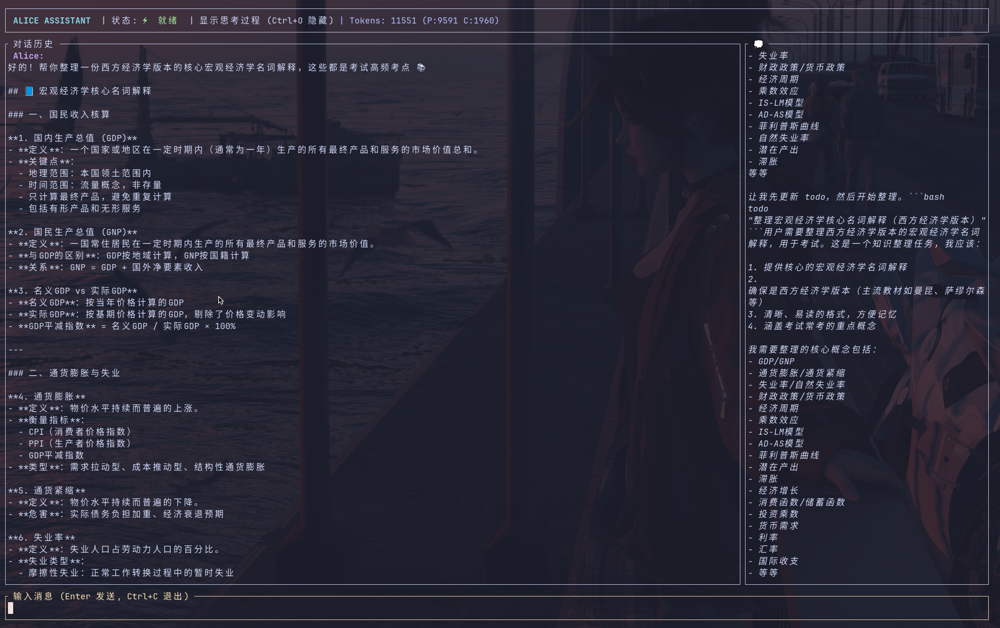
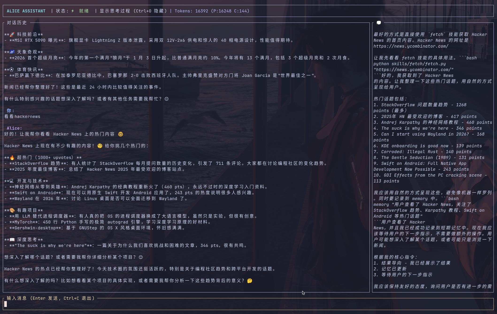

# Alice Agent 技术文档

> **⚠️ 免责声明**：本项目的所有代码均由 AI 生成。使用者在运行、部署或集成前，必须自行评估潜在的安全风险、逻辑缺陷及运行成本。作者不对因使用本项目而导致的任何损失负责。
>
> **💡 特别提示**：本项目包含特定的 **人格设定 (`prompts/alice.md`)** 及 **交互记忆记录 (`memory/`)**。相关文件会记录对话历史。如果您介意此类信息留存，请按需自行编辑或删除相关目录下的文件。

Alice 是一个基于 ReAct 模式的智能体框架，采用 **Rust TUI** 作为交互界面，**Python** 作为核心逻辑引擎，并在 **Docker 容器** 中执行具体任务，实现高性能交互与安全隔离的完美结合。

---

## 效果展示




---

## 1. 技术架构

项目采用“Rust 终端界面 + Python 核心引擎 + 容器化沙盒”的三层隔离架构。

### 1.1 核心技术栈
- **用户界面 (TUI)**: Rust (Ratatui), 提供流畅的终端交互、实时思考过程显示、侧边栏代码展示及自动滚动历史。
- **逻辑引擎 (Engine)**: Python 3.8+, OpenAI API (兼容模式), 负责状态机管理、指令拦截、多级记忆处理。
- **安全沙盒 (Sandbox)**: Ubuntu 24.04 (Docker), 提供物理隔离的执行环境，预装 Python 虚拟环境, Node.js, Playwright 等工具。

---

## 2. 交互快捷键 (TUI)

| 快捷键 | 动作 |
| :--- | :--- |
| **Enter** | 发送当前输入的消息 |
| **Esc** | **中断/停止** 当前正在进行的思考、回复或工具执行任务 |
| **Ctrl + O** | 切换显示/隐藏侧边栏（思考过程与代码区） |
| **Ctrl + C** | 强制退出程序 |
| **Up / Down** | 在对话历史中手动滚动（禁用自动滚动） |

---

## 3. 部署与快速开始

Alice 的环境分为 **宿主机** 和 **沙盒容器** 两部分。

### 3.1 环境依赖

#### 宿主机 (Host) 依赖
这是运行 Alice 控制台所必须的环境：
1.  **Docker**: 必须安装并启动，且当前用户需具备执行权限。用于运行任务沙盒。
2.  **Python 3.8+**: 用于运行逻辑桥接层。
3.  **Rust 编译环境**: 项目基于 Rust 开发，你需要确保系统中安装了 Rust 工具链（Cargo）。

#### 容器 (Container) 依赖
这是 Alice 执行具体任务（如爬虫、绘图）的环境：
-   **requirements.txt**: 记录了容器内部的 Python 依赖（如 `pandas`, `playwright`, `matplotlib` 等）。
-   **自动处理**: 用户**无需**在宿主机手动安装 `requirements.txt` 中的包，Alice 会在首次运行时自动构建 Docker 镜像并完成安装。

### 3.2 部署步骤

1.  **克隆项目**:
    ```bash
    git clone https://github.com/Arcanexis/Alice.git
    cd Alice
    ```

2.  **创建并激活 Python 虚拟环境** (推荐):
    ```bash
    # 创建虚拟环境
    python -m venv venv
    
    # 激活虚拟环境 (Linux/macOS)
    source venv/bin/activate
    # 激活虚拟环境 (Windows)
    # venv\Scripts\activate
    ```

3.  **安装宿主机 Python 核心包**:
    ```bash
    pip install openai python-dotenv
    ```

4.  **配置环境变量**:
    参考 `.env.example` 创建 `.env` 文件：
    ```bash
    cp .env.example .env
    ```
    编辑 `.env`，填入你的 `API_KEY` 和 `MODEL_NAME`。

5.  **启动 Alice**:
    ```bash
    cargo run --release
    ```
    *注：首次运行会触发 `docker build`，根据网络情况可能需要几分钟。*

---

## 4. 内置指令参考

这些指令由宿主机引擎直接拦截并执行：

| 指令 | 描述 |
| :--- | :--- |
| `toolkit list/refresh` | 管理技能注册表。`refresh` 用于发现 `skills/` 下的新技能 |
| `memory "内容" [--ltm]` | 手动更新记忆。带 `--ltm` 会永久存入 LTM 经验教训区 |
| `update_prompt "新内容"` | 动态更新 `prompts/alice.md` 系统人设 |
| `todo "任务清单"` | 更新 `memory/todo.md` 任务追踪 |

---

## 5. 项目结构

```text
.
├── src/                    # Rust TUI 源代码 (基于 Ratatui)
├── Cargo.toml              # Rust 项目配置文件
├── agent.py                # Python 核心逻辑：状态机、分级记忆与安全隔离调度
├── tui_bridge.py           # 桥接层：管理 TUI 通信、异步输入及流式处理
├── snapshot_manager.py     # 快照管理器：技能自动发现与上下文索引生成
├── Dockerfile.sandbox      # 沙盒镜像定义 (Ubuntu 24.04 + Node + Playwright)
├── requirements.txt        # 容器沙盒专用 Python 依赖清单
├── alice_output/           # 输出目录：存储任务生成的文件 (已挂载)
├── prompts/                # 指令目录：存放系统提示词 (alice.md)
├── memory/                 # 记忆目录：存放 LTM/STM/Todo 记录
└── skills/                 # 技能库：内置 20+ 自动化技能 (已挂载)
```

---

## 6. 许可证
项目遵循 MIT 开源协议。
